# Write up for The Betrayers

### Description

An IT company provides a critical service to customers. One day, the service is attacked by DDoS. The Attack is originated from within the company's internal network, and that each compromised host was sending a large number of requests to the server.

The attack occurred shortly after the company installed a new patch to one of its software programs. Every new version should be hosted by a special web server with DNS record in the private network but this time the new version is hosted by the Technical Director server!!!

The Technical Director is in trouble and he said that is not the attacker!

The strange thing is that the program is deleted directly after the blue team figure out the attack!

We need to get a release from that version and figure out how the attack occur!

> The binary expect to do DDoS attack on specifc IP. In this challenge we changed the IP and the rate of send requests

Download: [Link](https://drive.google.com/file/d/1QNUnd4CEXXrqAC9cnvlUE-AW-aeWDszd/view)

### Write-up

Ok Let's figure out what is happen. We get the disk image of the Technical Director system. The system that host the new program patch. (It must not be this one)

Let's start figure out what softwares are installed and check the history of the system.

Oh as expected there is a mail software. It's thunderbird. We will check it later.
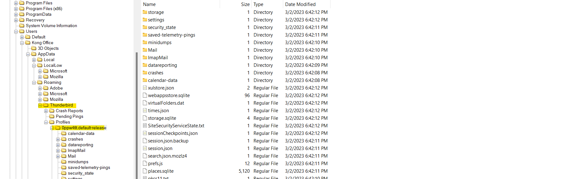

Let's Check the browsing history of the system and check what is going on here! We found Edge only here!

Go to `C:\Users\Kong Office\AppData\Local\Edge\UserData\Default` and check the `History` database

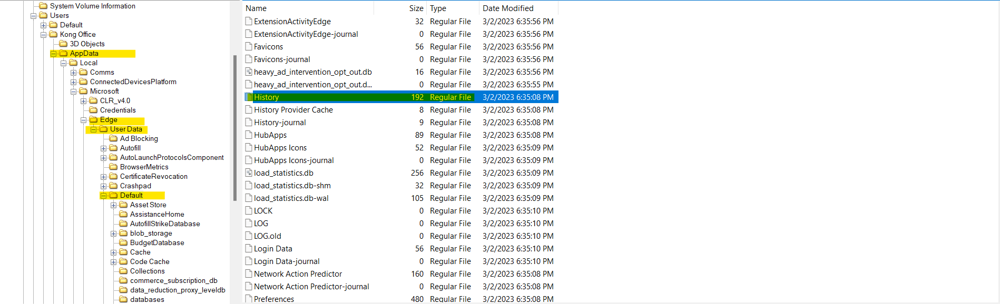

After checking every single link and search. we found searchs about whatsapp desktop how to install it and official whatsapp download website is visited.

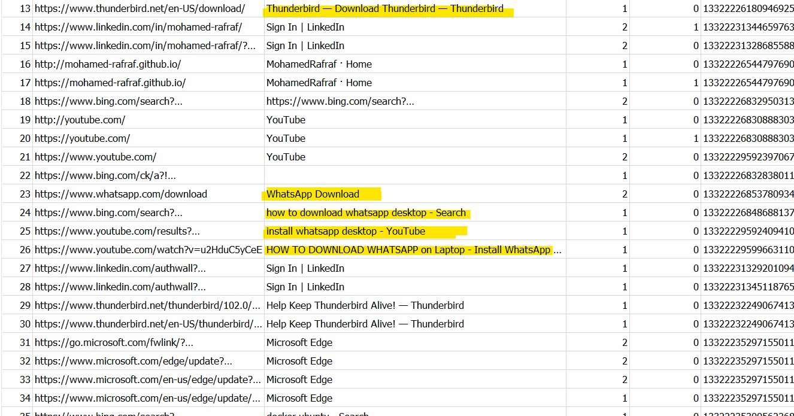

Thunderbird is installed for sure. But still no clue for whatsapp for now. Let's see what we have on the inbox now! It's time to check the mails! To check the inbox you can go to `C:\Users\Kong Office\AppData\Roaming\Thunderbird\Profiles\0ppw4tlt.default-release\ImapMail\imap.gmail.com` and investigate the `INBOX` file

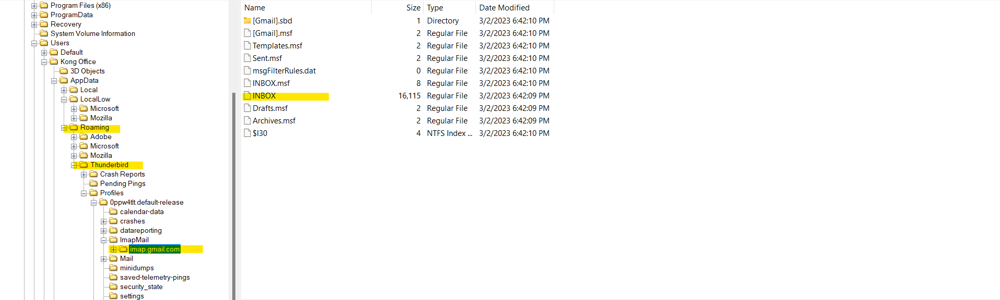

You can open the file using any text editor to check the mails but it's the worst way. you'll find the attachements encoded to base 64 and many trashy details

You'll get an ugly view like this if you open it with vscode.
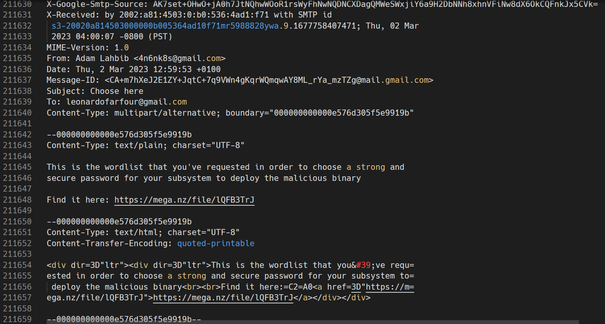

But you can choose any thunderbird inbox viewer available in the internet. I tried a random one and i got a better exeperience to understand what happen.

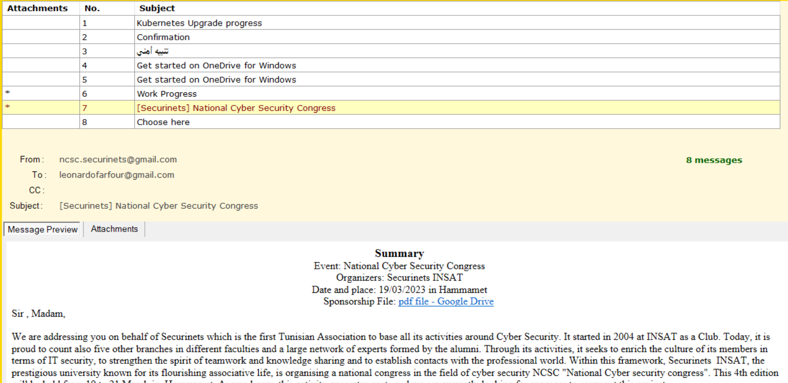

Let's summerize what we found. One mail telling that the kubernetes cluster is updgraded successfully from the platform engineer, another one from a system adminstration telling the Technical Director about the security updates. Another one from `Securinets INSAT` asking for sponsorship to the National Cyber Security Congress! And the suspicision one is from a dummy mail `4n6nk8s@gmail.com`. In this mail we found a clue!
A stranger tell the Technical Director about deploying a malicious binary and send a mega link! Ahhh Protected one

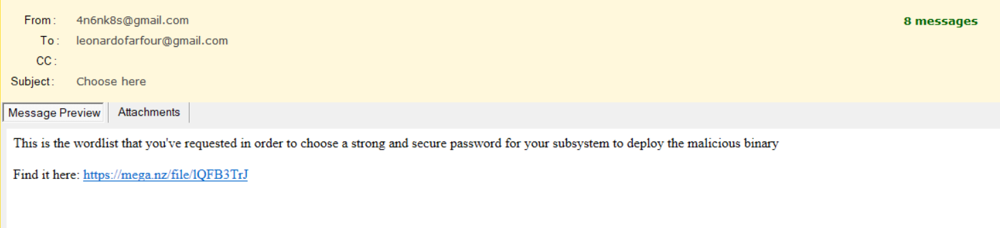

The link lead you to a wordlist that have strong and secure passwords. The mail talks about subsystem!! What a subsystem? Is it a `WSL` ??

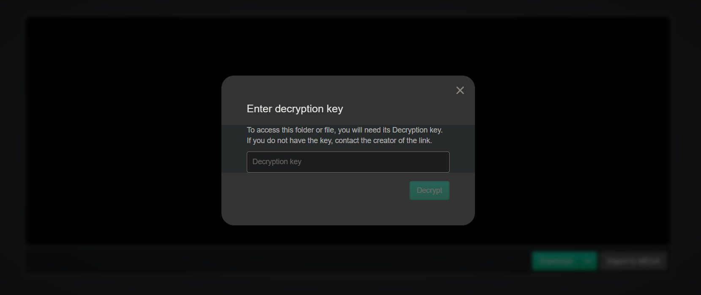

and here we finished mail browser history and mail investigation. still the whatsapp thing! Where is whatsapp hide his data?? good question. Checking AppData don't help us. We didn't find any WhatsApp directory!

After googling we found that there is some whatsapp version can store his data inside `%AppData%\Local\Packages`. Let's check that folder and Bingoo!! We found whatsapp directory! WhatsApp was installed here! Let's see what we can do here!

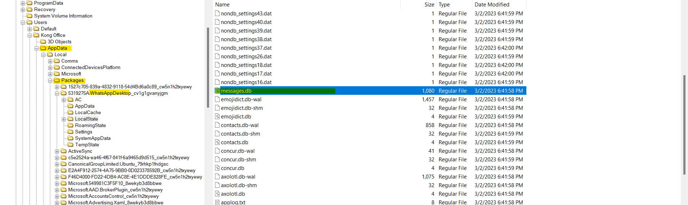

You can find some conversation inside `messages.db` file. It might be encrypted and it might be decrypted. Let's try to open this database and see what we can find here!

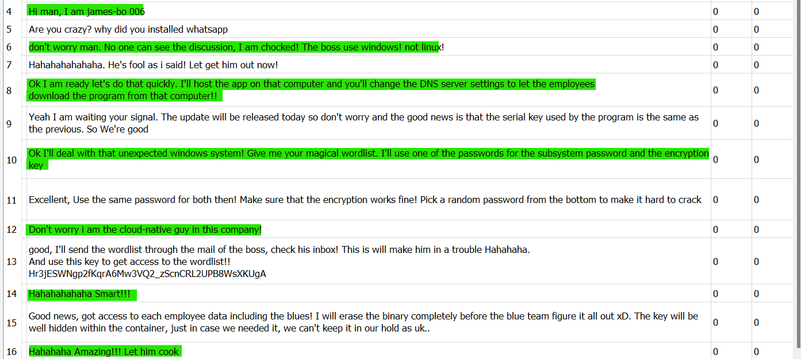

I am chocked!! Two employees were behind all this!!
Two employees hate the director and they want to be in a trouble!

The attackers talks about encryption and subsystem password and they are shocked because the system is windows! and yes the mega decryption key is shared in this discussion. They send the mail to the director to make it in trouble!!

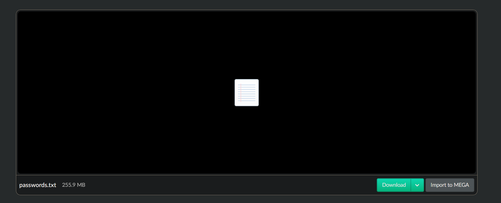

Let's download that wordlist and check the powershell history commands! I am sure there is something there. Because I found Hyber-V directory in random place while investigating. The history is stored in `%userprofile%\AppData\Roaming\Microsoft\Windows\PowerShell\PSReadline\ConsoleHost_history. txt`

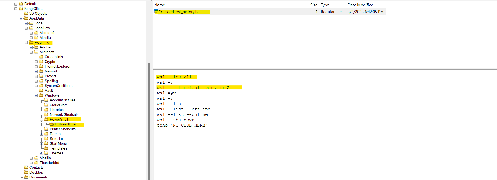

Yeah! Everything is cleared now! subsytem, subsystem! They are talking about WSL. WSL is installed here! and it used to host the malicious program! But what they does mean by encryption and the password. Mmmmm I guess we will face some cracking in the few next minutes!

Let's check WSL now! Where is windows store the WSL? Just check `%userprofile%\AppData\Local\Packages`

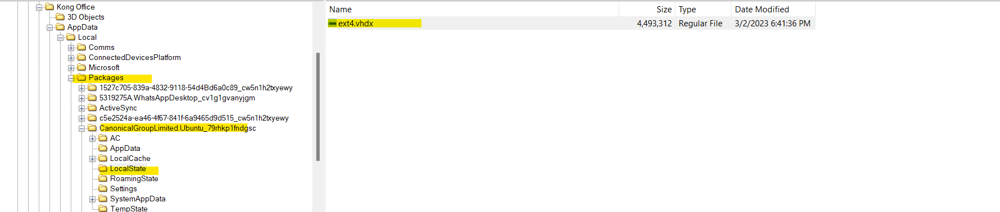

Let's mount this vhdx disk now in our Linux/WSL and check the files in this system. You can use `libguestfs-tools` to achieve this.

```bash
raf@4n6nk8s:~$ sudo apt-get install libguestfs-tools
```

Then, you can mount now the wsl disk image:
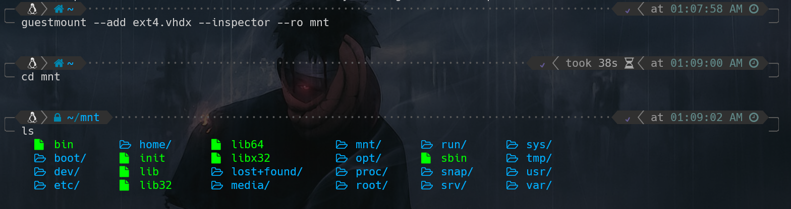

We found a user named `Kong` and have a home directory. Let's check his files and bash history!

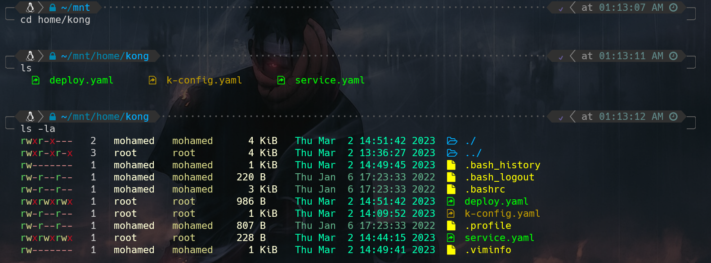

Let's start with `.bash_history` first. It's my number one rule!
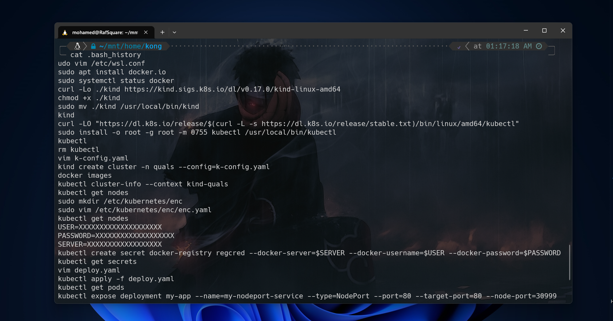

Wow! The attacker configure wsl.conf then install docker! Mmm He configure it to be boot with systemd!
Then he installed something called kind, After that he download `kubectl`! Kubectl??? Ah It's `Kubernetes` time!

But what is kind? Searching on it. I found that kind is Kubernetes inside Docker. It's a lightweight kubernetes cluster.

There is 3 yaml files. For sure there are worth to check! Let's see what is inside these files!

```yaml
### k-config.yaml content ####
kind: Cluster
apiVersion: kind.x-k8s.io/v1alpha4
networking:
  podSubnet: "10.244.0.0/16"
  serviceSubnet: "10.96.0.0/12"
  # the default CNI will not be installed
  disableDefaultCNI: false
           
nodes:
- role: control-plane
  # add a mount from /path/to/my/files on the host to /files on the node
  extraMounts:
  - hostPath: /etc/crio/crio.conf
    containerPath: /etc/crio/crio.conf
    # optional: if set, the mount is read-only.
    # default false
    readOnly: true
    # default false
    selinuxRelabel: false

  - hostPath: /etc/kubernetes
    containerPath: /etc/kubernetes
    # optional: if set, the mount is read-only.
    # default false
    readOnly: false
    # default false
    selinuxRelabel: false

  - hostPath: /var/lib/netcd
    containerPath: /var/lib/etcd
    # optional: if set, the mount is read-only.
    # default false
    readOnly: false
    # default false
    selinuxRelabel: false
- role: worker
  kubeadmConfigPatches:
  - |
    kind: JoinConfiguration
    nodeRegistration:
      kubeletExtraArgs:
        node-labels: "app-type=web-app"
  extraPortMappings:
  - containerPort: 30999
    hostPort: 80
    # optional: set the bind address on the host
    # 0.0.0.0 is the current default
    listenAddress: "0.0.0.0"
    # optional: set the protocol to one of TCP, UDP, SCTP.
    # TCP is the default
    protocol: TCP
```

It's a kind cluster configuration file!! This fiel is used to declare the specification of your cluster! And as you see `/etc/kubernetes` and `/var/lib/etcd` are mounted. We have 2-node cluster and a `extraPortMappings` to expose a service. In addition there is node-labels on the worker-node

> This challenge requires some kubernetes knowledge. You must be familiar with the basics of the kubernetes. Like nodes, deployements, pods, services, etc...

```yaml
### content deploy.yaml ###
apiVersion: apps/v1
kind: Deployment
metadata:
  creationTimestamp: null
  labels:
    app: update-app
  name: update-app
spec:
  replicas: 1
  selector:
    matchLabels:
      app: update-app
  strategy: {}
  template:
    metadata:
      creationTimestamp: null
      labels:
        app: update-app
    spec:
      imagePullSecrets:
        - name: regcred
      containers:
      - image: medrafk8s/kubersex
        name: update-app
        resources:
          requests:
            memory: "64Mi"
            cpu: "250m"
          limits:
            memory: "128Mi"
            cpu: "500m"
      affinity:
        nodeAffinity:
            requiredDuringSchedulingIgnoredDuringExecution:
                nodeSelectorTerms:
                - matchExpressions:
                    - key: app-type
                      operator: In
                      values:
                      - web-app
                      - front-end
status: {}
```

This is a deployment manifest that pull a private image `medrafk8s/kubersex` using the imagePullSecrets fields! The nodeAffinity is used for some scheduling specification. In this example the deployment will be deployed in node with labels `app-type=web-app`

Let's summerize now! The attacker installed Kind to deploy the web app that hosts the malicious inside a kubernetes cluster!

So our objective is to recover the webapp that contains the malicious binary! But how can we restore that container! It's a private container! What we should to do?

To get the private container we need to get the pull secret. The credential that allow us to pull the container image! The credential are stored inside a `secret` (Kubernetes Object).

According to the bash history we have this commands:

```bash
USER=XXXXXXXXXXXXXXXXXXXX
PASSWORD=XXXXXXXXXXXXXXXXXXX
SERVER=XXXXXXXXXXXXXXXXXX
kubectl create secret docker-registry regcred --docker-server=$SERVER --docker-username=$USER --docker-password=$PASSWORD
kubectl get secrets
```

> The attacker store the credential inside environement and create a pull secret using `kubectl` command

The only way to get the credential is to extract the secret from the `etcd`. But We have a problem! The etcd is protected!

Let's Back to the bash history you'll find that the attacker edit a `kube-apiserver.yaml` and `enc.yaml`.

```yaml
### enc.yaml ###
apiVersion: apiserver.config.k8s.io/v1
kind: EncryptionConfiguration
resources:
  - resources:
    - secrets
    providers:
      - identity: {}
      - secretbox:
          keys:
            - name: key1
              secret: <BASE64 ENCODED>
```

Let's talk a little about the `Encryption Configuration` in Kubernetes.


As known. Etcd is a distributed key-value store that is used by Kubernetes to store and retrieve the configuration data for the cluster. The Kubernetes API server interacts with etcd to read and write configuration data, such as the current state of the cluster and the desired state. The etcd data store serves as the single source of truth for the Kubernetes cluster's configuration data, and the API server ensures that this data is always up to date and consistent across the cluster.

The API server accepts an argument `--encryption-provider-config` that controls how API data is encrypted in etcd. In other words, API server can store the data inside etcd but not in plain text! It's encrypted to secure the data inside the database! for more details check this [link](https://kubernetes.io/docs/tasks/administer-cluster/encrypt-data/)

So our mission now is to find the secret value of the `EncryptionConfiguration` to use it after restoring the etcd by setting up a new api server that can read the encrypted data from the `etcd`.

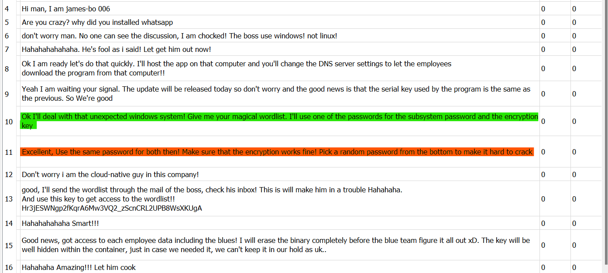

Getting back to the whatsapp discussion. The attacker use the same password for the encryption key and subsystem password!

Bingo!! Crack time! We know that the encryption key must be 32 bytes. So this information will help us filtering the downloaded wordlist!

Linux stores user passwords hashes in `/etc/shadow`. Great, we have the hash and the wordlist! Let's do it!

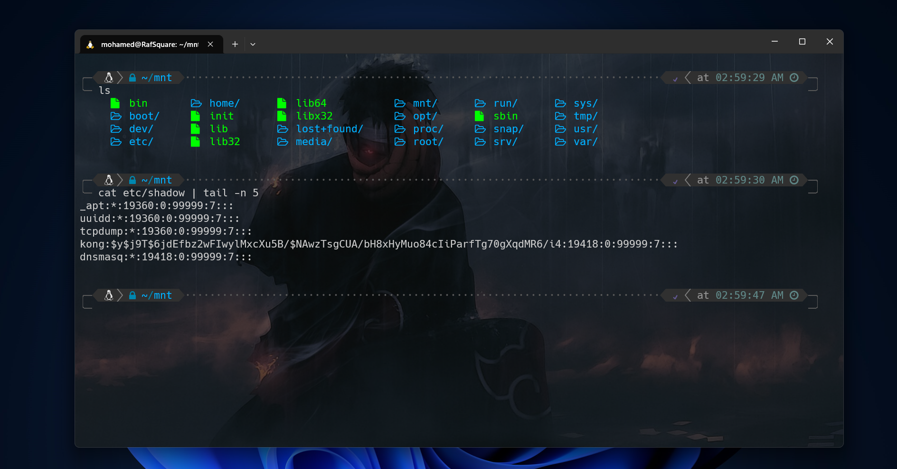

Let's start filter out the passwords with 32 characters from the wordlist using grep and tail to pick from the bottom:

```bash
grep -E '^.{32}$' passwords.txt | tail -n 100000 > pass.txt
```

Now it's time to extract the user information from `/etc/shadow` and `/etc/password`

```bash
grep kong etc/passwd > passwd.txt
grep kong etc/shadow > shadow.txt
```

Before start cracking using `John The Ripper`. We need to combine the passwd and shadow into a format that john can read. `unshadow` can do this work!

```bash
unshadow passwd.txt shadow.txt > crack-me.txt
```

Now our hash is ready for crack. Let's use john with `--format=crypt` to specify that we are trying to crack yescrypt hash

```bash
john --wordlist=pass.txt crack-me.txt --format=crypt
```

After some minutes we got the password!! The password is : `@a*Hd~u32@q1Db/LUiOFxC*W2THm5p*V`

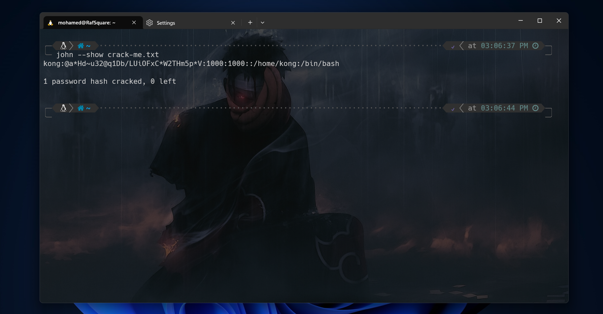

Now it's time to resotre the `etcd`. Restoring a Kubernetes cluster in case of a disaster can be accomplished using etcd snapshots. However, the process of restoring an etcd snapshot is not straightforward and requires expertise. Actually in kubernetes etcd can take snapshot automatically. So we will count on that.

In this case i will use Kind to generate a lightweight cluster. In case you will use your own cluster you must to know that restoring etcd can lead you to lost your cluster data. So be careful!

To keep it simple I'll use the same configuration as `k-config.yaml`.

```bash
kind create cluster --config=k-config.yaml
Creating cluster "kind" ...
 ✓ Ensuring node image (kindest/node:v1.25.3) 🖼
...
...

kubectl cluster-info --context kind-kind

Have a nice day! 👋
```

In Kind each node will be represented as a container

```bash
raf@4n6nk8s:~$ docker ps
CONTAINER ID   IMAGE                  COMMAND                  CREATED         STATUS         PORTS
  NAMES
eba4afe51855   kindest/node:v1.25.3   "/usr/local/bin/entr…"   2 minutes ago   Up 2 minutes   127.0.0.1:43323->6443/tcp   kind-control-plane
13d7b697ba1f   kindest/node:v1.25.3   "/usr/local/bin/entr…"   2 minutes ago   Up 2 minutes   0.0.0.0:80->30999/tcp       kind-worker
```

After making sure that the api-server works correctly we need to add the `Encryption Configuration` to make sure that the api server can read the encrypted data after restoring etcd.

Go and put this file on `/etc/kubernetes/enc/enc.yaml`

```yaml
apiVersion: apiserver.config.k8s.io/v1
kind: EncryptionConfiguration
resources:
  - resources:
    - secrets
    providers:
      - identity: {}
      - secretbox:
          keys:
            - name: key1
              secret: QGEqSGR+dTMyQHExRGIvTFVpT0Z4QypXMlRIbTVwKlY=
```

Then go to `/etc/kubernetes/manifests/api-server.yaml` to add these lines.

```yaml
apiVersion: v1
kind: Pod
metadata:
  annotations:
    kubeadm.kubernetes.io/kube-apiserver.advertise-address.endpoint: 172.18.0.2:6443
  creationTimestamp: null
  labels:
    component: kube-apiserver
    tier: control-plane
  name: kube-apiserver
  namespace: kube-system
spec:
  containers:
  - command:
    - kube-apiserver
    ...
    - --encryption-provider-config=/etc/kubernetes/enc/enc.yaml  # <-- add this line
    volumeMounts:
    ...
    - name: enc                           # <-- add this line
      mountPath: /etc/kubernetes/enc      # <-- add this line
      readonly: true                      # <-- add this line
    ...
  volumes:
  ...
  - name: enc                             # <-- add this line
    hostPath:                             # <-- add this line
      path: /etc/kubernetes/enc           # <-- add this line
      type: DirectoryOrCreate             # <-- add this line
  ...
```

After changing the manifest the api-server will be stopped and down. If you did it corretly, you need to wait a few seconds until the api-server works again!

After configuring the api-server correctly let's take the content `/var/lib/netcd` and try to use the `db` as our snapshot that we want to restore it!

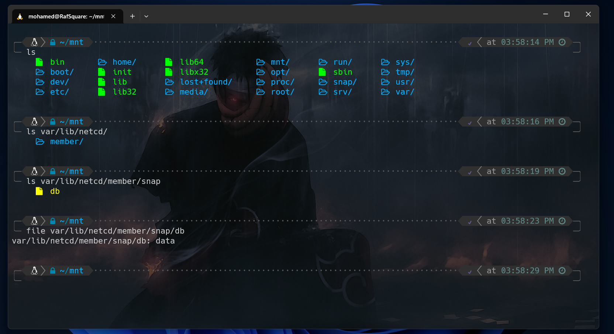

I suggest to copy `db` inside the control-plane node (in this case container). I will copy it to one of the extraMounts of kind.

Now let's open a shell inside the control-plane container:

```bash
docker exec -it kind-control-plane bash
```

Now we need to use an utility called etcdctl that will help us to interact with the etcd server.

```bash
apt update 
apt install etcd-client
```

After install it succesfully. An important thing it must be done. Don't skip this step! you must export an env variable to make etcdctl behave as we need!

```bash
export ETCDTL_API=3
```

now it's time to use this utility! There is a resotre command in this utility that allow us to restore the backup or the snapshot

```bash

etcdctl --endpoints=https://[etcd-server] \
--cacert=<path-to-ca-certification> \
--cert=<path-to-etcd-server-cert> \
--key=<path-to-etcd-server-key> \
--data-dir <path-to-restored-data> \ 
snapshot restore <path-to-snapshot>
```

You need to fill this arguments with your own. you can get theses information from `/etc/kubernetes/manifests/etcd.yaml`

In my case the command it will be like this:

```bash
ETCDTL_API=3 etcdctl --endpoints=https://[127.0.0.1:2379] \
--cacert=/etc/kubernetes/pki/etcd/ca.crt \
--cert=/etc/kubernetes/pki/etcd/server.crt \
--key=/etc/kubernetes/pki/etcd/server.key \
--data-dir /var/lib/etcd-backup \
snapshot restore ./db
```

You migth get an error or warning about hash stuff after running this command. Skip it! Let's check if `/var/lib/etcd-backup` directory is created and if it contains `member` directory!

If you got it! Then you are on the right way! Now it's time to do the crazy thing! Let's replace our new data placed in `/var/lib/etcd-backup/member/snap` to the original etcd database!

```bash
cp /var/lib/etcd-backup/member/snap/db /var/lib/etcd/member/snap/
```

Just wait few seconds! and try a kubectl command!

```bash
kubectl get nodes
NAME                  STATUS     ROLES           AGE   VERSION
kind-control-plane    NotReady   <none>          51m   v1.25.3
kind-worker           NotReady   <none>          51m   v1.25.3
quals-control-plane   Ready      control-plane   26h   v1.25.3
quals-worker          Ready      <none>          26h   v1.25.3
```

Bingo! It works fine! but as you see here we have nodes naming issues cause of the data of the etcd!

Let's check if we have a secret object or not!

```bash
kubectl get secrets
NAME      TYPE                             DATA   AGE
regcred   kubernetes.io/dockerconfigjson   1      26h
```

And Yes!!! We got our secret! Let's now inspect the data inside it!

```bash
 kubectl get secret regcred -o jsonpath='{.data.\.dockerconfigjson}' | base64 -d
{"auths":{"docker.io":{"username":"medrafk8s","password":"dckr_pat_MLkRjYtjdk7dwT80W_dx3VTuac8","auth":"bWVkcmFmazhzOmRja3JfcGF0X01Ma1JqWXRqZGs3ZHdUODBXX2R4M1ZUdWFjOA=="}}}
```

And finally! The registry is `docker.io`, the username is `medrafk8s` and the password is `dckr_pat_MLkRjYtjdk7dwT80W_dx3VTuac8`

With this creds we can pull the container that host the malicious binary and analyse his traffic! Let's do it!

```bash
raf@4n6nk8s:~$ docker login docker.io -u medrafk8s -p dckr_pat_MLkRjYtjdk7dwT80W_dx3VTuac8
WARNING! Using --password via the CLI is insecure. Use --password-stdin.
Login Succeeded
```

Let's pull this image now!

```bash
raf@4n6nk8s:~$ docker pull medrafk8s/kubersex
Using default tag: latest
latest: Pulling from medrafk8s/kubersex
c158987b0551: Pull complete
1e35f6679fab: Pull complete
cb9626c74200: Pull complete
b6334b6ace34: Pull complete
f1d1c9928c82: Pull complete
9b6f639ec6ea: Pull complete
ee68d3549ec8: Downloading [=======>                                           ]  1.813MB/11.49MB
4caa31e6cbc5: Download complete
a1434f597582: Waiting
```

The 1st i used to do when I pull a container image in forensics challenges is to check the layers of the image!

```bash
raf@4n6nk8s:~$ docker history medrafk8s/kubersex
IMAGE          CREATED          CREATED BY                                      SIZE      COMMENT
77a3b3f4c35c   13 minutes ago   /bin/sh -c #(nop)  CMD ["nginx" "-g" "daemon…   0B
0b383b70426b   13 minutes ago   /bin/sh -c rm Serial-Key.txt                    0B
b6ca15406c7d   13 minutes ago   /bin/sh -c #(nop)  EXPOSE 80                    0B
64eaf6945cd1   13 minutes ago   /bin/sh -c #(nop) COPY file:ed75fc1a725ff91b…   20B
748d1b219207   13 minutes ago   /bin/sh -c #(nop) COPY dir:48e5409ee398a470a…   5.4MB
4937520ae206   6 weeks ago      /bin/sh -c set -x     && apkArch="$(cat /etc…   29.6MB
<missing>      6 weeks ago      /bin/sh -c #(nop)  ENV NJS_VERSION=0.7.12       0B
<missing>      6 weeks ago      /bin/sh -c #(nop)  CMD ["nginx" "-g" "daemon…   0B
<missing>      6 weeks ago      /bin/sh -c #(nop)  STOPSIGNAL SIGQUIT           0B
<missing>      6 weeks ago      /bin/sh -c #(nop)  EXPOSE 80                    0B
<missing>      6 weeks ago      /bin/sh -c #(nop)  ENTRYPOINT ["/docker-entr…   0B
<missing>      6 weeks ago      /bin/sh -c #(nop) COPY file:e57eef017a414ca7…   4.62kB
<missing>      6 weeks ago      /bin/sh -c #(nop) COPY file:36429cfeeb299f99…   3.01kB
<missing>      6 weeks ago      /bin/sh -c #(nop) COPY file:d4375883ed5db364…   276B
<missing>      6 weeks ago      /bin/sh -c #(nop) COPY file:5c18272734349488…   2.12kB
<missing>      6 weeks ago      /bin/sh -c #(nop) COPY file:7b307b62e82255f0…   1.62kB
<missing>      6 weeks ago      /bin/sh -c set -x     && addgroup -g 101 -S …   4.74MB
<missing>      6 weeks ago      /bin/sh -c #(nop)  ENV PKG_RELEASE=1            0B
<missing>      6 weeks ago      /bin/sh -c #(nop)  ENV NGINX_VERSION=1.25.1     0B
<missing>      6 weeks ago      /bin/sh -c #(nop)  LABEL maintainer=NGINX Do…   0B
<missing>      6 weeks ago      /bin/sh -c #(nop)  CMD ["/bin/sh"]              0B
<missing>      6 weeks ago      /bin/sh -c #(nop) ADD file:828b07e74c184e7f2…   7.05MB
```

This is a webserver! Something important is here. No one can ignore the `Serial-Key.txt` file
We will get it later! Let's run the web app now

```bash
raf@4n6nk8s:~$ sudo docker run --name kubersex -p 81:80 medrafk8s/kubersex
/docker-entrypoint.sh: /docker-entrypoint.d/ is not empty, will attempt to perform configuration
/docker-entrypoint.sh: Looking for shell scripts in /docker-entrypoint.d/
/docker-entrypoint.sh: Launching /docker-entrypoint.d/10-listen-on-ipv6-by-default.sh
10-listen-on-ipv6-by-default.sh: info: Getting the checksum of /etc/nginx/conf.d/default.conf
10-listen-on-ipv6-by-default.sh: info: Enabled listen on IPv6 in /etc/nginx/conf.d/default.conf
/docker-entrypoint.sh: Sourcing /docker-entrypoint.d/15-local-resolvers.envsh
/docker-entrypoint.sh: Launching /docker-entrypoint.d/20-envsubst-on-templates.sh
/docker-entrypoint.sh: Launching /docker-entrypoint.d/30-tune-worker-processes.sh
/docker-entrypoint.sh: Configuration complete; ready for start up
2023/08/02 17:37:52 [notice] 1#1: using the "epoll" event method
2023/08/02 17:37:52 [notice] 1#1: nginx/1.25.1
2023/08/02 17:37:52 [notice] 1#1: built by gcc 12.2.1 20220924 (Alpine 12.2.1_git20220924-r4)
```

Mmm there is a Download button! Press it and you will get a binary! Bingo! This is the malicious release!

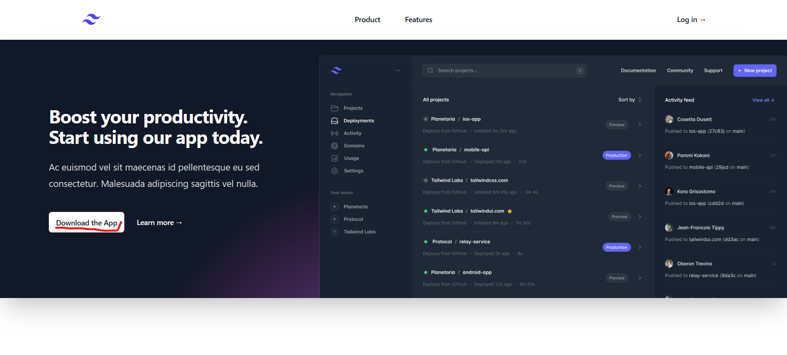

After checking the binary and run it, we found that the binary requires a serial key! Let's recover that file!

```bash
raf@4n6nk8s:~$ docker save medrafk8s/medraf > image.tar 
raf@4n6nk8s:~$ tar -xf image.tar 
raf@4n6nk8s:~$ cd aae4861ba6bde0fbe820ba547bbe794c7c7e9c8be14c8972a6691eaa584161bc
raf@4n6nk8s:~$ tar -xf layer.tar && ls
Serial-Key.txt  VERSION  json  layer.tar
```

And this is the content of the file !

```
I will put the serial key in the container image in case you forget! YOU FOOOOL YOU USED TO FORGET IT! GO AND DESTROY THE SERVICE WITH THE BOSS HOST!

KEY:
KFTV-RCFL-VC5W-HX3X
```

> At this point you can reverse the binary and get the flag! or patch the binary to change a IP server with your choice! In this step reversing is the main idea so i put a public IP of a reachable server to make the binary send packets when players decice to run it !

Let's continue:

Run the binary again and insert that key! It seems the binary works! I bet this is the responsible binary for the DDoS attack! So, I will check the behavior of this binary and open Wireshark while this one is running!

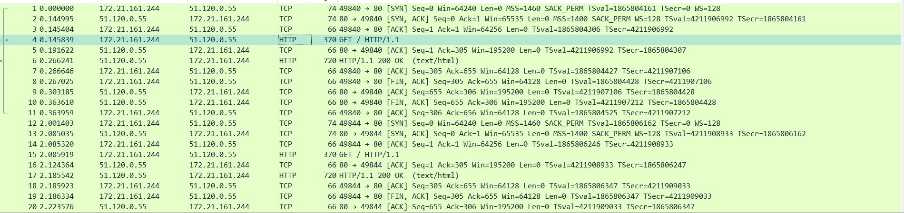

Mmmm this is http flow! Let's check the requests!

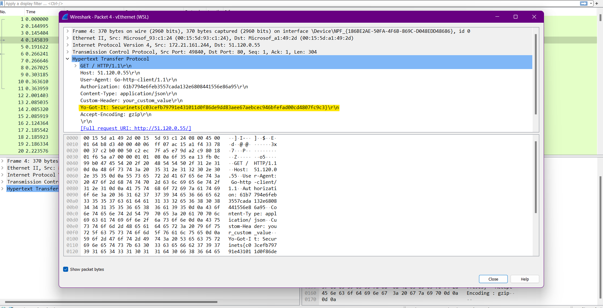

Binggo we got the flag! The flag is on the http header

FLAG: `Securinets{c03cefb79791e431011d0f86de9dd83aee67aebcec946bfefad00cd4807fc9c3}`
